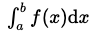
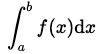
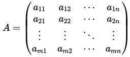

# react-realtime-markup-editor

A text document editor which is syntactically formattable in real time

- The document editor is inspired by [Scrapbox](https://scrapbox.io/product)
- Icons made from [Icon Fonts](http://www.onlinewebfonts.com/icon) is licensed by CC BY 3.0

## TL;DR

### Installation

```sh
npm install katex
npm install react-realtime-markup-editor
```

or

```sh
yarn add katex
yarn add react-realtime-markup-editor
```

### Simplest Usage

```tsx
import { Editor } from 'react-realtime-markup-editor';
import 'katex/dist/katex.min.css';

const App: React.FC = () => {
  const [text, setText] = React.useState('');
  return <Editor text={text} onChangeText={setText} />;
};
```

### Browsers support

| [](http://godban.github.io/browsers-support-badges/)<br/>Firefox | [](http://godban.github.io/browsers-support-badges/)<br/>Chrome |
| ----------------------------------------------------------------------------------------------------------------------------------------------------------------------------------------------------------------- | ------------------------------------------------------------------------------------------------------------------------------------------------------------------------------------------------------------- |
| last 2 versions                                                                                                                                                                                                   | last 2 versions                                                                                                                                                                                               |

### Demo

[demo](https://kumachan-mis.github.io/react-realtime-markup-editor) on github pages

## Formatting Syntax

### Itemizations

#### bracket-based syntax

| style         | syntax  |
| ------------- | ------- |
| <li>item</li> | `␣item` |

#### markdown-like syntax

| style         | syntax  |
| ------------- | ------- |
| <li>item</li> | `-item` |
| <li>item</li> | `*item` |

**Note**  
Multiple spaces will provide nested itemizations.

### Text Decorations

#### bracket-based syntax

| style            | syntax          |
| ---------------- | --------------- |
| <b>bold</b>      | `[* bold]`      |
| <h3>larger</h3>  | `[** larger]`   |
| <h2>largest</h2> | `[*** largest]` |
| <i>italic</i>    | `[/ italic]`    |
| <u>underline</u> | `[_ underline]` |

**Note**  
Combinations of `*`, `/` and `_` are available.  
Here are some examples:

| style                          | syntax                                             |
| ------------------------------ | -------------------------------------------------- |
| <b><i>bold italic</i></b>      | `[*/ bold italic]` or `[/* bold italic]`           |
| <b><u>bold underline</u></b>   | `[*_ bold underline]` or `[_* bold underline]`     |
| <i><u>italic underline</u></i> | `[/_ italic underline]` or `[_/ italic underline]` |

#### markdown-like syntax

| style            | syntax      |
| ---------------- | ----------- |
| <b>bold</b>      | `*bold*`    |
| <h3>larger</h3>  | `## larger` |
| <h2>largest</h2> | `# largest` |
| <i>italic</i>    | `_italic_`  |

**Note**  
Combinations of `*` and `_` are NOT available yet...

### Links

| style                   | syntax               |
| ----------------------- | -------------------- |
| <a>blacket link</a>     | `[blacket link]`     |
| <a>tag: tagged link</a> | `[tag: tagged link]` |
| <a>#hash-tag</a>        | `#hash-tag`          |

**Note**
A space(`␣`) in a hashtag name will get converted to an underscore(`_`).

### Code Strings

#### inline code string

- style  
  `inline code string`
- syntax  
  `` `inline code string` ``

#### block code string

- style
  ```
  block code string
  ```
- syntax
  ````
  ```
  block code string
  ```
  ````

### Math Formulas

### inline math formula

- style  
  
- syntax  
  `$\int_a^b f(x) \mathrm{d}x$`

### display math formula

- style  
  
- syntax  
  `$$\int_a^b f(x) \mathrm{d}x$$`

### block math formula

- style  
  
- syntax
  ```
  $$
  A =
  \left(
  \begin{matrix}
    a_{11} & a_{12} & \cdots & a_{1n} \\
    a_{21} & a_{22} & \cdots & a_{2n} \\
    \vdots & \vdots & \ddots & \vdots \\
    a_{m1} & a_{m2} & \cdots & a_{mn} \\
  \end{matrix}
  \right)
  $$
  ```

### Quatations

- style
  > quotation
- syntax  
  `>quotation`

**Note**

1. Tagged links are useful when you want to make some link groups  
   Here are some examples:

- Can make `[github: @user_name/repository_name]` go to

```html
<a href="https://github.com/user_name/repository_name"> @user_name/repository_name </a>
```

- Can make `[npm: package_name]` go to

```html
<a href="https://www.npmjs.com/package/package_name"> package_name </a>
```

2. Can show input suggestions of links  
   For example, you can provide users with webpage list which may be refered from the document

## Public API

| name                 | type                                     | requried/optional | default                                   | description                                                                                                         |
| -------------------- | ---------------------------------------- | ----------------- | ----------------------------------------- | ------------------------------------------------------------------------------------------------------------------- |
| `text`               | `string`                                 | requried          | -                                         | syntactic text in `Editor`<br>you will use this like<br>`text={this.state.text}`                                    |
| `onChangeText`       | `(text: string) => void`                 | requried          | -                                         | callback function on `text` changed<br>you will use this like<br>`onChangeText={(text) => this.setState({ text })}` |
| `textProps`          | `TextProps`                              | optional          | see [TextProps](#TextProps)               | general settings of text<br>details: [TextProps](#TextProps)                                                        |
| `bracketLinkProps`   | `BracketLinkProps`                       | optional          | see [BracketLinkProps](#BracketLinkProps) | settings of bracket links<br>details: [BracketLinkProps](#BracketLinkProps)                                         |
| `hashTagProps`       | `HashTagProps`                           | optional          | see [HashTagProps](#HashTagProps)         | settings of hash tags<br>details: [BracketLinkProps](#HashTagProps)                                                 |
| `taggedLinkPropsMap` | `{ [tagName: string]: TaggedLinkProps }` | optional          | see [TaggedLinkProps](#TaggedLinkProps)   | key-value object which maps a tag name to settings of tagged links<br>details: [TaggedLinkProps](#TaggedLinkProps)  |
| `codeProps`          | `CodeProps`                              | optional          | see [CodeProps](#CodeProps)               | settings of code strings<br>details: [CodeProps](#CodeProps)                                                        |
| `formulaProps`       | `FormulaProps`                           | optional          | see [FormulaProps](#FormulaProps)         | settings of math formulas<br>details: [FormulaProps](#FormulaProps)                                                 |
| `readonly`           | `boolean`                                | optional          | `undefined` (falsy)                       | if `true`, make `text` uneditable                                                                                   |
| `className`          | `string`                                 | optional          | `undefined`                               | className of `Editor`                                                                                               |
| `style`              | `CSSProperties`                          | optional          | `undefined`                               | style of `Editor`                                                                                                   |

### TextProps

general settings of text

```ts
interface TextProps {
  suggestions?: string[];
  initialSuggestionIndex?: number;
}
```

- suggestions: input suggestions of normal texts  
  default: `[]`
- initialSuggestionIndex: index of focusd suggestion when showing the suggestion list  
  default: `0`

### BracketLinkProps

settings of bracket links

```ts
interface BracketLinkProps {
  anchorProps?: (linkName: string) => React.ComponentProps<'a'>;
  suggestions?: string[];
  initialSuggestionIndex?: number;
  disabled?: boolean;
}
```

**Attributes**

- anchorProps: given `linkName`, this function returns props of `<a>` tag and overridden style on hover  
  default: `undefined`
- suggestions: input suggestions of bracket links  
  default: `[]`
- initialSuggestionIndex: index of focusd suggestion when showing the suggestion list  
  default: `0`
- disabled: if `true`, syntax of bracket links is ignored  
  default: `undefined` (falsy)

### HashTagProps

settings of hash tags

```ts
interface HashTagProps {
  anchorProps?: (hashTagName: string) => React.ComponentProps<'a'>;
  suggestions?: string[];
  initialSuggestionIndex?: number;
  disabled?: boolean;
}
```

same as `BracketLinkProps`

### TaggedLinkProps

settings of tagged links

```ts
interface TaggedLinkProps {
  linkNameRegex?: RegExp;
  anchorProps?: (linkName: string) => React.ComponentProps<'a'>;
  suggestions?: string[];
  initialSuggestionIndex?: number;
  tagHidden?: boolean;
}
```

same as `BracketLinkProps` except `linkNameRegex` and `tagHidden`  
`disabled` property doesn't exist since you don't define a tag if you don't need it

**Attributes**

- linkNameRegex: regular expression of link names. This **MUST** be a subset of `defaultLinkNameRegex = /[^[\]]+/`  
  If `tagged link` does not match the pattern, `[tag: tagged link]` will be a BRACKET LINK whose name is `tag: tagged link`  
  default: `defaultLinkNameRegex`
- tagHidden: if `true`, `[tag: tagged link]` goes to `<a>tagged link</a>` instead of `<a>tag: tagged link</a>`

**Default**

```ts
export const defaultLinkNameRegex = /[^[\]]+/;
```

you can import `defaultLinkNameRegex` by adding

```ts
import { defaultLinkNameRegex } from 'react-realtime-markup-editor';
```

### CodeProps

settings of code strings

```ts
interface CodeProps {
  codeProps?: (code: string) => React.ComponentProps<'code'>;
  disabled?: boolean;
}
```

**Attributes**

- codeProps: given `code`, this function returns props of `<code>` tag  
  default: `undefined`
- disabled: if `true`, syntax of code strings is ignored  
  default: `undefined` (falsy)

### FormulaProps

settings of math formulas

```ts
interface FormulaProps {
  spanProps?: (formula: string) => React.ComponentProps<'span'>;
  disabled?: boolean;
}
```

**Attributes**

- spanProps: given `formula`, this function returns props of `<formula>` tag  
  default: `undefined`
- disabled: if `true`, syntax of math formulas is ignored  
  default: `undefined` (falsy)
